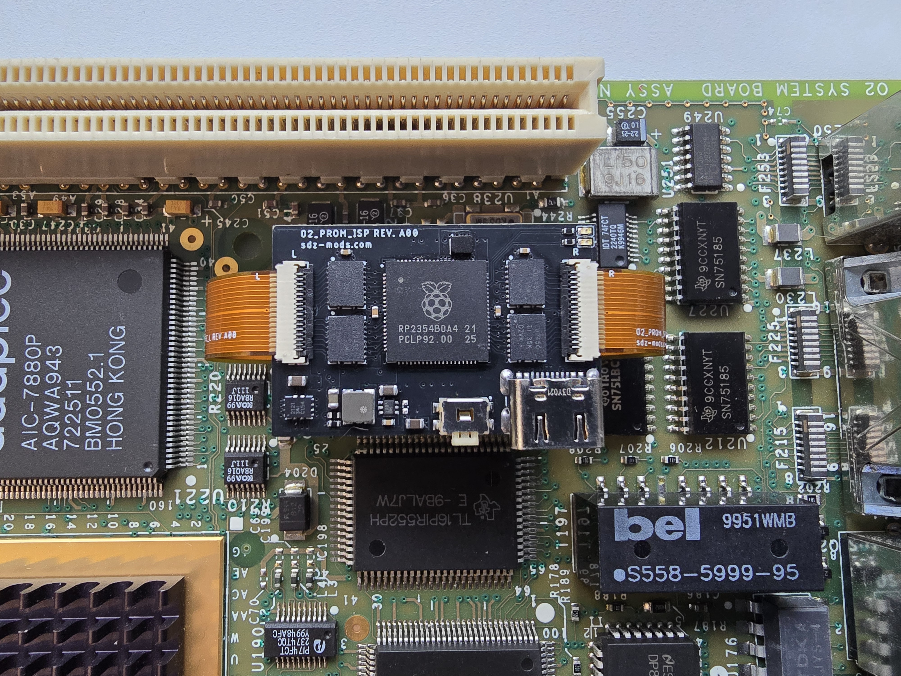

# SGI O2 PROM ISP

In-system programmer for the SGI O2 system PROM. It which allows writing/dumping the system PROM via USB. This can be done at any point, with the system on or off.
Mechanically compatible with all O2 CPU modules.



## Installation instructions:

-remove Dallas socket

-remove flash IC

-solder the two FFCs

-solder Dallas socket back

-install Dallas IC

-solder the flash IC to the ISP

-mount ISP on top of Dallas IC, connect the two FFCs.


### Flashing/dumping PROM

```csh
python3 O2_FLASH_PROM.py --port COM38 --flash IP32_418_dump.bin --verify

Opening port: COM38

File : IP32_418_dump.bin  (524,288 bytes)

Flash: 524,288 bytes  |  Chunks: 128 × 4096 bytes


Flashing...

Flashing: [########################################] 100%

Flash complete.


Verifying...

Verifying: [########################################] 100%

Verify passed — flash contents match file.


python3 O2_FLASH_PROM.py --port /dev/ttyUSB0 --dump testdump.bin

Opening port: /dev/ttyUSB0

Dumping 524,288 bytes to: testdump.bin

Dumping: [########################################] 100%

Dump complete. Saved 524,288 bytes to 'testdump.bin'
```


## Contents

1.SCH_BRD - contains editable schematic and board files. Format is Eagle CAD, but they can be imported in other tools, like Kicad.

2.SCH_PDF- schematics in pdf format.

3.P&P - pick and place files

4.BOM

5.GERBER - gerber files

6.FIRMWARE - pre-built firmware to be flashed on the RP2040

7.FIRMWARE_SRC - firmware source code plus support files.

8.HOST_TOOL - host flashing script

9.PHOTOS - installation photos

## Notes

-There is a very high probabilty if you install this and flash a firmware, you won't be able to setenv -p or resetenv from PROM. This isn't related to the ISP, it happens even when swapping the flash ICs between two working motherboards.
